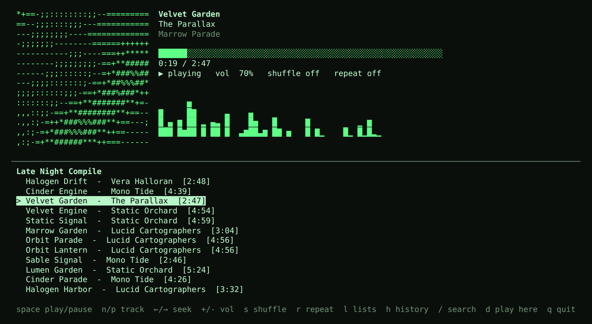

# Tonegrid

A Spotify terminal client with ASCII art. One Python file, standard library only.



*Demo mode (`--demo`): mock library, same interface as the real thing.*

**Live demo (mock library, runs in your browser):** https://otisranson.github.io/Tonegrid/

- Full-screen curses player: animated ASCII art, progress bar, spectrum bars, playlists, search
- Album art rendered as ASCII when [Pillow](https://pypi.org/project/Pillow/) is installed; otherwise a plasma generated from the track id
- OAuth with PKCE, so there is no client secret to store
- `tonegrid --demo` runs against an offline mock library, so you can try it without an account

## Use

```
python3 tonegrid.py --demo                  # try it, no account
python3 tonegrid.py login --client-id ID    # once
python3 tonegrid.py                         # player
python3 tonegrid.py now                     # print current track as ASCII art
```

## Play audio in the terminal (spotifyd)

Spotify's Web API is a remote control, so something has to actually play the audio. Tonegrid
starts [spotifyd](https://docs.spotifyd.rs) for you as a child process, which shows up in Spotify
as a device called "tonegrid", and stops it when you quit.

1. Install spotifyd (the `default` Linux build works) and put it on your PATH or in `~/.local/bin`.
   On Linux it needs PulseAudio client libraries (`sudo apt install libpulse0`); on WSL2 audio
   goes through WSLg.
2. Once: `python3 tonegrid.py setup` (spotifyd's own browser login; needs Premium).
3. Run `python3 tonegrid.py`. If nothing else is playing, Tonegrid claims playback for the terminal.
   Press `d` to move playback to the terminal at any time.

If spotifyd is missing, not set up, or crashes, Tonegrid keeps running as a remote control and
shows the reason on the bottom line (`d` restarts it). Its log is `~/.config/tonegrid/spotifyd.log`.
`--no-player` skips the daemon entirely.

## Spotify app setup

Create a free app at <https://developer.spotify.com/dashboard> with redirect URI
`http://127.0.0.1:8888/callback`, and use its client id. Playback control needs
**Spotify Premium** and an active device (open any Spotify app once). Tokens are stored in
`~/.config/tonegrid/auth.json` (mode 600); `tonegrid logout` deletes them.

## Keys

| key | action | key | action |
|---|---|---|---|
| space | play / pause | `l` | playlists |
| `n` / `p` | next / previous | `/` | search |
| `←` / `→` | seek 5s | `↑↓` `j k` | move in list |
| `+` / `-` | volume | enter | open / play |
| `s` / `r` | shuffle / repeat | backspace | back |
| `d` | play in this terminal | `h` | history (recently played) |
| | | `/` | search (recent searches shown, ↑↓ to pick) |

## Notes

- The spectrum bars are decorative, seeded from the track id. Spotify does not expose live audio to third-party apps.
- Tested against the mock backend only; the live Spotify calls follow the public Web API but have not been exercised against a real account.

MIT licensed.
